# Guía de Integración Frontend - Autenticación SAML

**Fecha:** 1 de Octubre, 2025  
**Sistema:** SGMM (Sistema de Gestión de Gastos Médicos Mayores)  
**Estado:** ✅ Backend Listo para Integración

---

## 📋 Resumen

Esta guía detalla cómo integrar el frontend con el sistema de autenticación SAML implementado en el backend. El flujo está 100% funcional y probado.

---

## 🔐 Flujo de Autenticación Completo

```mermaid
sequenceDiagram
    participant Usuario
    participant Frontend
    participant Backend
    participant Google
    participant Database

    Usuario->>Frontend: Clic en "Iniciar Sesión"
    Frontend->>Backend: GET /api/auth/saml/login
    Backend->>Google: Redirección a Google SAML
    Google->>Usuario: Formulario de autenticación
    Usuario->>Google: Credenciales
    Google->>Backend: POST /api/auth/saml/callback
    Backend->>Database: findByEmail(email)
    Database-->>Backend: Employee data
    Backend->>Backend: Genera JWT
    Backend->>Frontend: Set-Cookie + Redirect /dashboard
    Frontend->>Backend: GET /api/auth/me
    Backend-->>Frontend: {authenticated: true, user: {...}}
    Frontend->>Usuario: Muestra Dashboard
```



---

## 🎯 Endpoint Principal: GET /api/auth/me

### Descripción
Verifica la sesión activa del usuario y retorna sus datos.

### URL
```
GET http://localhost:3000/api/auth/me
```

### Headers Requeridos
```
Cookie: session_token=<jwt_token>
```

**IMPORTANTE:** El frontend debe configurar el cliente HTTP para enviar cookies automáticamente.

---

## 📤 Respuestas del Endpoint

### ✅ Respuesta Exitosa (200 OK)

```json
{
  "authenticated": true,
  "user": {
    "id": "emp-123",
    "employee_number": "3619",
    "email": "jonahatan.angeles@siegfried.com.mx",
    "full_name": "Jonahatan Angeles",
    "role": "collaborator",
    "company_id": "company-1"
  },
  "session": {
    "expires_at": "2025-10-01T15:30:00.000Z",
    "issued_at": "2025-10-01T14:30:00.000Z"
  }
}
```

### ❌ Respuesta: Sin Token (401 Unauthorized)

```json
{
  "authenticated": false,
  "error": "No session token",
  "message": "No se encontró token de sesión. Por favor, inicia sesión."
}
```

### ❌ Respuesta: Token Expirado (401 Unauthorized)

```json
{
  "authenticated": false,
  "error": "Token expired",
  "message": "Tu sesión ha expirado. Por favor, inicia sesión nuevamente."
}
```

### ❌ Respuesta: Token Inválido (401 Unauthorized)

```json
{
  "authenticated": false,
  "error": "Invalid token",
  "message": "Token de sesión inválido. Por favor, inicia sesión nuevamente."
}
```

---

## 💻 Implementación Frontend

### 1. Configuración del Cliente HTTP

#### Axios
```typescript
import axios from 'axios';

const apiClient = axios.create({
  baseURL: 'http://localhost:3000',
  withCredentials: true, // ⚠️ CRÍTICO: Envía cookies automáticamente
  headers: {
    'Content-Type': 'application/json'
  }
});

export default apiClient;
```

#### Fetch
```typescript
const fetchWithCredentials = async (url: string, options = {}) => {
  const response = await fetch(url, {
    ...options,
    credentials: 'include', // ⚠️ CRÍTICO: Envía cookies automáticamente
    headers: {
      'Content-Type': 'application/json',
      ...options.headers
    }
  });
  
  return response;
};
```

#### React Query (Recomendado)
```typescript
import { QueryClient } from '@tanstack/react-query';
import axios from 'axios';

const queryClient = new QueryClient({
  defaultOptions: {
    queries: {
      retry: 1,
      refetchOnWindowFocus: false,
    },
  },
});

const apiClient = axios.create({
  baseURL: 'http://localhost:3000',
  withCredentials: true,
});

export { queryClient, apiClient };
```

---

### 2. Hook de Autenticación (React)

```typescript
// hooks/useAuth.ts
import { useQuery, useMutation, useQueryClient } from '@tanstack/react-query';
import { apiClient } from '../api/client';

interface User {
  id: string;
  employee_number: string;
  email: string;
  full_name: string;
  role: string;
  company_id: string;
}

interface Session {
  expires_at: string;
  issued_at: string;
}

interface AuthResponse {
  authenticated: boolean;
  user?: User;
  session?: Session;
  error?: string;
  message?: string;
}

export const useAuth = () => {
  const queryClient = useQueryClient();

  // Verificar sesión activa
  const { data, isLoading, error, refetch } = useQuery<AuthResponse>({
    queryKey: ['auth', 'me'],
    queryFn: async () => {
      const response = await apiClient.get('/api/auth/me');
      return response.data;
    },
    retry: false, // No reintentar si falla
    staleTime: 5 * 60 * 1000, // 5 minutos
  });

  // Logout
  const logoutMutation = useMutation({
    mutationFn: async () => {
      const response = await apiClient.get('/api/auth/logout');
      return response.data;
    },
    onSuccess: () => {
      // Limpiar cache de React Query
      queryClient.clear();
      
      // Redirigir a login
      window.location.href = '/login';
    },
  });

  return {
    user: data?.user,
    session: data?.session,
    isAuthenticated: data?.authenticated ?? false,
    isLoading,
    error,
    refetch,
    logout: logoutMutation.mutate,
  };
};
```

---

### 3. Componente ProtectedRoute

```typescript
// components/ProtectedRoute.tsx
import { Navigate, Outlet } from 'react-router-dom';
import { useAuth } from '../hooks/useAuth';

interface ProtectedRouteProps {
  children?: React.ReactNode;
}

export const ProtectedRoute: React.FC<ProtectedRouteProps> = ({ children }) => {
  const { isAuthenticated, isLoading } = useAuth();

  // Mostrar loading mientras verifica sesión
  if (isLoading) {
    return (
      <div className="flex items-center justify-center min-h-screen">
        <div className="animate-spin rounded-full h-12 w-12 border-b-2 border-blue-600" />
      </div>
    );
  }

  // Si no está autenticado, redirigir a login
  if (!isAuthenticated) {
    return <Navigate to="/login" replace />;
  }

  // Si está autenticado, mostrar contenido
  return children ? <>{children}</> : <Outlet />;
};
```

---

### 4. Configuración de Rutas (React Router)

```typescript
// App.tsx
import { BrowserRouter, Routes, Route } from 'react-router-dom';
import { QueryClientProvider } from '@tanstack/react-query';
import { queryClient } from './api/client';
import { ProtectedRoute } from './components/ProtectedRoute';
import LoginPage from './pages/LoginPage';
import DashboardPage from './pages/DashboardPage';
import EmployeeEditPage from './pages/EmployeeEditPage';

function App() {
  return (
    <QueryClientProvider client={queryClient}>
      <BrowserRouter>
        <Routes>
          {/* Ruta pública */}
          <Route path="/login" element={<LoginPage />} />
          
          {/* Rutas protegidas */}
          <Route element={<ProtectedRoute />}>
            <Route path="/dashboard" element={<DashboardPage />} />
            <Route path="/collaborator/:id" element={<EmployeeEditPage />} />
          </Route>
          
          {/* Redirección por defecto */}
          <Route path="/" element={<Navigate to="/dashboard" replace />} />
        </Routes>
      </BrowserRouter>
    </QueryClientProvider>
  );
}

export default App;
```

---

### 5. Página de Login

```typescript
// pages/LoginPage.tsx
import { useEffect } from 'react';
import { useNavigate } from 'react-router-dom';
import { useAuth } from '../hooks/useAuth';

const LoginPage: React.FC = () => {
  const navigate = useNavigate();
  const { isAuthenticated } = useAuth();

  // Si ya está autenticado, redirigir al dashboard
  useEffect(() => {
    if (isAuthenticated) {
      navigate('/dashboard', { replace: true });
    }
  }, [isAuthenticated, navigate]);

  const handleSAMLLogin = () => {
    // Redirigir al endpoint SAML del backend
    window.location.href = 'http://localhost:3000/api/auth/saml/login';
  };

  return (
    <div className="min-h-screen flex items-center justify-center bg-gray-100">
      <div className="max-w-md w-full bg-white rounded-lg shadow-lg p-8">
        <div className="text-center mb-8">
          <h1 className="text-3xl font-bold text-gray-900">SGMM</h1>
          <p className="text-gray-600 mt-2">Sistema de Gestión de Gastos Médicos Mayores</p>
        </div>

        <button
          onClick={handleSAMLLogin}
          className="w-full flex items-center justify-center gap-3 bg-blue-600 text-white py-3 px-4 rounded-md hover:bg-blue-700 transition-colors font-semibold"
        >
          <svg className="w-5 h-5" viewBox="0 0 24 24" fill="currentColor">
            <path d="M22.56 12.25c0-.78-.07-1.53-.2-2.25H12v4.26h5.92c-.26 1.37-1.04 2.53-2.21 3.31v2.77h3.57c2.08-1.92 3.28-4.74 3.28-8.09z"/>
            <path d="M12 23c2.97 0 5.46-.98 7.28-2.66l-3.57-2.77c-.98.66-2.23 1.06-3.71 1.06-2.86 0-5.29-1.93-6.16-4.53H2.18v2.84C3.99 20.53 7.7 23 12 23z"/>
            <path d="M5.84 14.09c-.22-.66-.35-1.36-.35-2.09s.13-1.43.35-2.09V7.07H2.18C1.43 8.55 1 10.22 1 12s.43 3.45 1.18 4.93l2.85-2.22.81-.62z"/>
            <path d="M12 5.38c1.62 0 3.06.56 4.21 1.64l3.15-3.15C17.45 2.09 14.97 1 12 1 7.7 1 3.99 3.47 2.18 7.07l3.66 2.84c.87-2.6 3.3-4.53 6.16-4.53z"/>
          </svg>
          Iniciar sesión con Google
        </button>

        <p className="text-sm text-gray-500 text-center mt-6">
          Utiliza tu cuenta corporativa de Siegfried o Weser para acceder
        </p>
      </div>
    </div>
  );
};

export default LoginPage;
```

---

### 6. Componente Dashboard

```typescript
// pages/DashboardPage.tsx
import { useAuth } from '../hooks/useAuth';

const DashboardPage: React.FC = () => {
  const { user, session, logout } = useAuth();

  if (!user) return null;

  // Calcular tiempo restante de sesión
  const expiresAt = new Date(session?.expires_at ?? '');
  const now = new Date();
  const minutesLeft = Math.floor((expiresAt.getTime() - now.getTime()) / (1000 * 60));
  const showWarning = minutesLeft < 15;

  return (
    <div className="min-h-screen bg-gray-100">
      {/* Header */}
      <header className="bg-white shadow">
        <div className="max-w-7xl mx-auto px-4 py-6 flex justify-between items-center">
          <div>
            <h1 className="text-3xl font-bold text-gray-900">Dashboard</h1>
            <p className="text-sm text-gray-600">Bienvenido, {user.full_name}</p>
          </div>
          
          <button
            onClick={() => logout()}
            className="px-4 py-2 bg-red-600 text-white rounded-md hover:bg-red-700 transition-colors"
          >
            Cerrar Sesión
          </button>
        </div>
      </header>

      {/* Advertencia de sesión próxima a expirar */}
      {showWarning && (
        <div className="bg-yellow-50 border-l-4 border-yellow-400 p-4 max-w-7xl mx-auto mt-4">
          <div className="flex">
            <div className="flex-shrink-0">
              <svg className="h-5 w-5 text-yellow-400" viewBox="0 0 20 20" fill="currentColor">
                <path fillRule="evenodd" d="M8.257 3.099c.765-1.36 2.722-1.36 3.486 0l5.58 9.92c.75 1.334-.213 2.98-1.742 2.98H4.42c-1.53 0-2.493-1.646-1.743-2.98l5.58-9.92zM11 13a1 1 0 11-2 0 1 1 0 012 0zm-1-8a1 1 0 00-1 1v3a1 1 0 002 0V6a1 1 0 00-1-1z" clipRule="evenodd" />
              </svg>
            </div>
            <div className="ml-3">
              <p className="text-sm text-yellow-700">
                Tu sesión expirará en {minutesLeft} minutos. Guarda tu trabajo.
              </p>
            </div>
          </div>
        </div>
      )}

      {/* Contenido principal */}
      <main className="max-w-7xl mx-auto px-4 py-8">
        <div className="bg-white rounded-lg shadow p-6">
          <h2 className="text-xl font-semibold mb-4">Información del Usuario</h2>
          
          <dl className="grid grid-cols-1 gap-4 sm:grid-cols-2">
            <div>
              <dt className="text-sm font-medium text-gray-500">Nombre Completo</dt>
              <dd className="mt-1 text-sm text-gray-900">{user.full_name}</dd>
            </div>
            
            <div>
              <dt className="text-sm font-medium text-gray-500">Email</dt>
              <dd className="mt-1 text-sm text-gray-900">{user.email}</dd>
            </div>
            
            <div>
              <dt className="text-sm font-medium text-gray-500">Número de Empleado</dt>
              <dd className="mt-1 text-sm text-gray-900">{user.employee_number}</dd>
            </div>
            
            <div>
              <dt className="text-sm font-medium text-gray-500">ID</dt>
              <dd className="mt-1 text-sm text-gray-900">{user.id}</dd>
            </div>
          </dl>
        </div>
      </main>
    </div>
  );
};

export default DashboardPage;
```

---

## 🔒 Consideraciones de Seguridad

### 1. **Cookies HttpOnly**
✅ El backend ya está configurado para usar `httpOnly: true`, lo que previene que JavaScript acceda a la cookie.

### 2. **HTTPS en Producción**
⚠️ Asegúrate de que en producción:
```typescript
secure: env.isProduction(), // Cookie solo se envía por HTTPS
sameSite: 'lax',           // Protección contra CSRF
```

### 3. **CORS Configuration**
El backend debe permitir las peticiones del frontend:

```typescript
// Ya configurado en backend
CORS_ORIGIN=http://localhost:8080
```

En producción:
```
CORS_ORIGIN=https://tu-dominio.com
```

### 4. **Validación de Sesión en Cada Carga**
```typescript
// Ejecutar en App.tsx o layout principal
useEffect(() => {
  // Verificar sesión al cargar la aplicación
  refetch();
}, []);
```

---

## 🧪 Pruebas de Integración

### Escenario 1: Login Exitoso
1. Usuario abre http://localhost:8080/login
2. Clic en "Iniciar sesión con Google"
3. Redirigido a Google SAML
4. Autenticación exitosa
5. Backend establece cookie
6. Redirigido a http://localhost:8080/dashboard
7. Frontend llama a `/api/auth/me`
8. Dashboard muestra datos del usuario

### Escenario 2: Sesión Expirada
1. Usuario está en el dashboard
2. Sesión expira (1 hora)
3. Usuario navega a otra página
4. `/api/auth/me` retorna 401
5. ProtectedRoute redirige a /login

### Escenario 3: Usuario No Autorizado
1. Usuario autenticado en Google
2. Email no existe en la BD
3. Backend retorna 403
4. Usuario ve mensaje de error

---

## 📝 Variables de Entorno Frontend

```env
# .env.development
VITE_API_URL=http://localhost:3000
VITE_FRONTEND_URL=http://localhost:8080

# .env.production
VITE_API_URL=https://api.tu-dominio.com
VITE_FRONTEND_URL=https://tu-dominio.com
```

---

## 🚀 Siguiente Paso: Testing E2E

Una vez integrado el frontend, realizar pruebas de extremo a extremo:

```typescript
// cypress/e2e/auth.cy.ts
describe('Flujo de Autenticación SAML', () => {
  it('debe permitir login exitoso con Google', () => {
    cy.visit('/login');
    cy.contains('Iniciar sesión con Google').click();
    
    // Google SAML mock o ambiente de testing
    // ...
    
    cy.url().should('include', '/dashboard');
    cy.contains('Bienvenido, Jonahatan Angeles');
  });
});
```

---

## 📞 Soporte

Para consultas sobre la integración:
- **Backend:** Endpoint `/api/auth/me` completamente funcional y probado
- **Tests:** 39 pruebas unitarias y de integración pasando
- **Documentación Backend:** `/home/gcloud/proyecto_sgmm/backend/TESTING_REPORT.md`

---

**¡El backend está listo para la integración frontend!** 🎉

